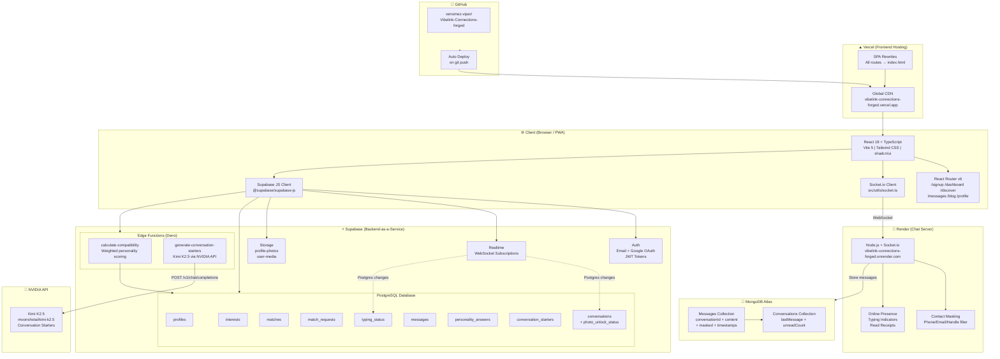
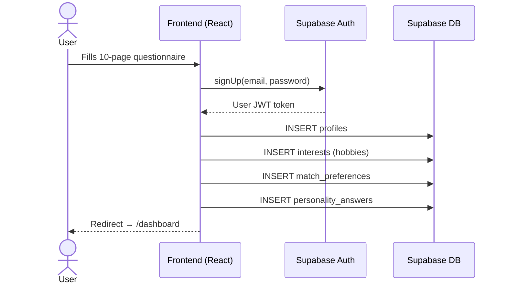
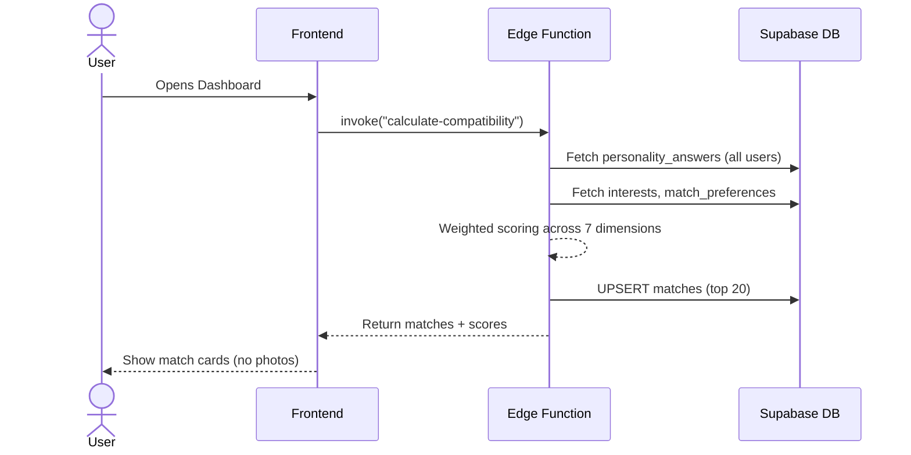
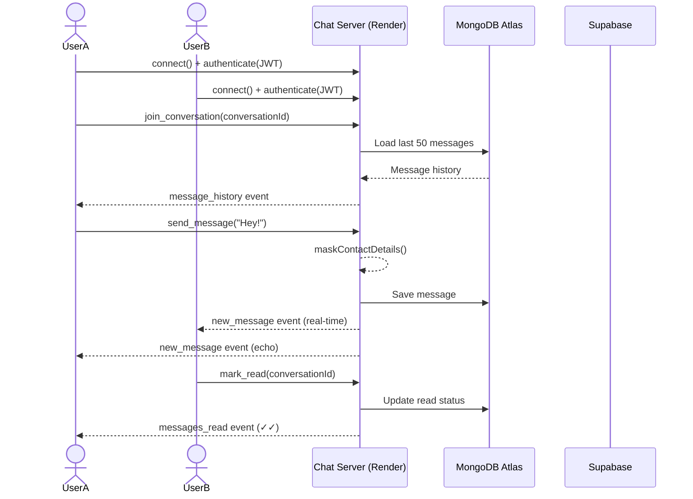
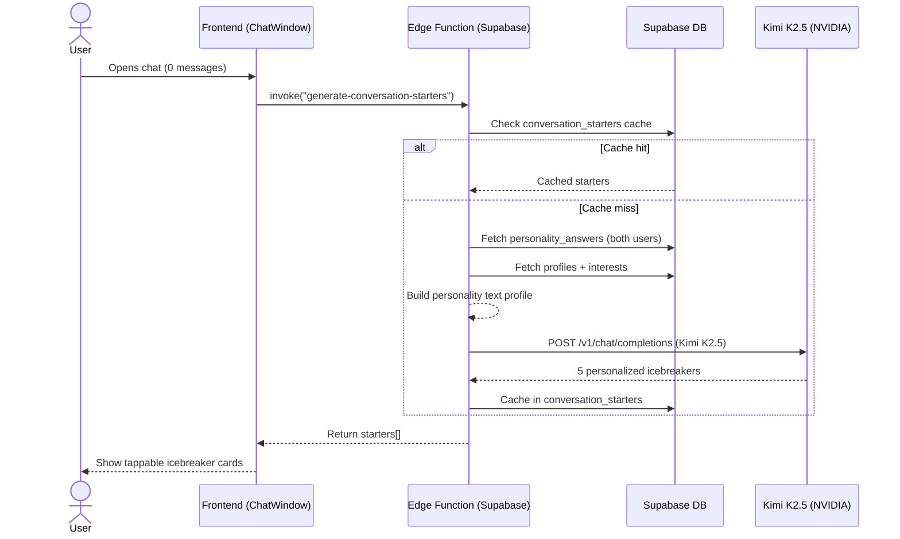
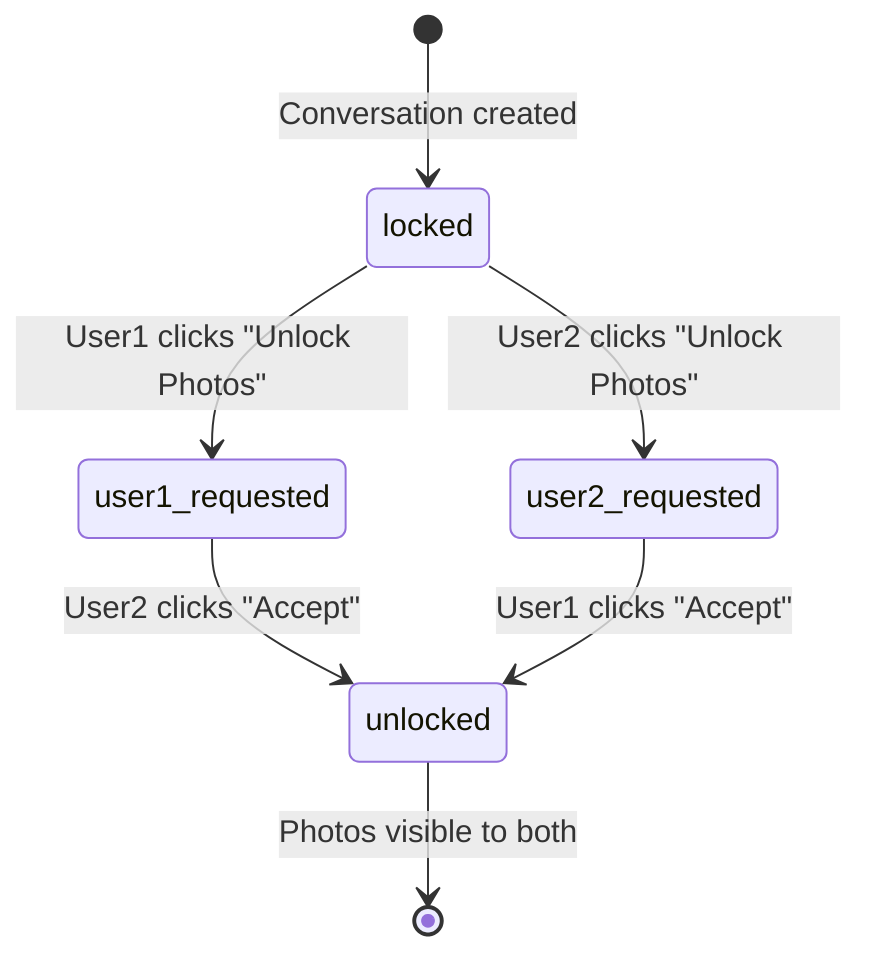

# VibeLink — Architecture Diagram

## Full System Architecture

---

## Data Flow: New User Signup

---

## Data Flow: Matching

---

## Data Flow: Real-Time Chat

---

## Data Flow: AI Conversation Starters

---

## Photo Unlock Flow

---

## Tech Stack Summary

| Layer | Technology |
|-------|-----------|
| Frontend | React 18, TypeScript, Vite, Tailwind, shadcn/ui |
| Routing | React Router v6 |
| Hosting | Vercel (global CDN) |
| Auth | Supabase Auth (JWT, Google OAuth) |
| Database | Supabase PostgreSQL |
| Realtime (legacy) | Supabase Realtime |
| Chat Server | Node.js + Socket.io (Render) |
| Chat Storage | MongoDB Atlas |
| AI Matching | Weighted algorithm (client) + Edge Function |
| AI Conversation | Kimi K2.5 via NVIDIA API |
| File Storage | Supabase Storage |
| Version Control | GitHub |
| CI/CD | Vercel auto-deploy on push |
